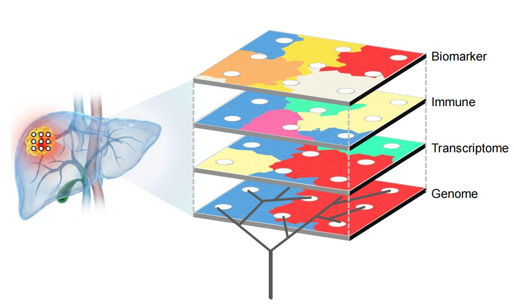

# LIGOR: Liver Cancer Geospatial Omics Resource 

  

LIGOR is a comprehensive database designed to characterize the heterogeneity of hepatocellular carcinoma based on multi-omics data. It enables the exploration of multi-layer information across cohorts, facilitating the discovery of clinical relevance, spatial distribution patterns and others. You can visit at http://ligor.especies.cn/home.

  

If you have any questions, please open an issue here or reach out to us at epg@ioz.ac.cn.

# Key Features
* **Geospatial Analysis**
  Visualize multi-modal heterogeneity of molecular features within and between a large group of HCC patients.
* **Temporal Analysis**
  Timing multi-modal changes by mapping them onto the phylogenetic tree.
* **Custom Analysis**
  Support user-defined subgrouping analysis in gene expression, biomarker and survival analysis.

# How to use
This repository provides the visualization scripts for data available for download through the LIGOR web interface. These scripts enable users to directly reproduce high-quality, publication-ready visualizations using the downloaded data.

# How to cite
